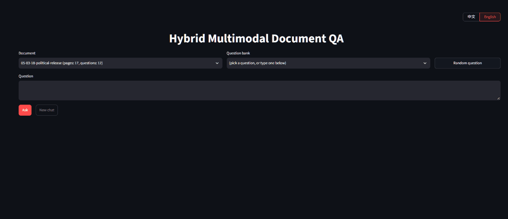
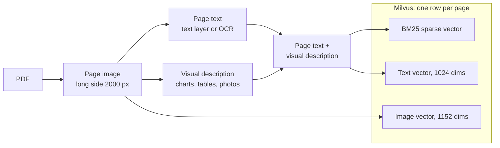
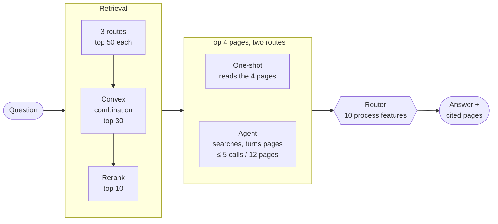

# Hybrid Multimodal Document RAG

<p>
  <a href="./README.md"></a>
  <a href="./README.en.md"></a>
</p>

> Question answering over long PDFs: every page is indexed both as **text** and as an **image**, and a vision model answers from the page images. Each question runs through two answer routes — **one-shot answering** and an **agent** — and a lightweight classifier picks one of them based on how each answer was produced.




*Demo: three questions in a row on Costco's 2021 annual report — reading a table --> a follow-up completed from the conversation --> EBITDA, which the report never states, found and computed by the agent after searching and turning pages; the router adopts the agent.*

On [MMLongBench-Doc](https://huggingface.co/datasets/yubo2333/MMLongBench-Doc) (snapshot of 2026-09-14: 135 PDFs, 6522 pages, 1082 questions, 48 pages per document on average), closed-domain retrieval reaches **r@1 0.581 / r@10 0.897** and answering reaches **Acc 0.677**. Every comparison comes with a paired bootstrap 95% confidence interval.

## Contents

- [Hybrid Multimodal Document RAG](#hybrid-multimodal-document-rag)
  - [Contents](#contents)
  - [Features](#features)
  - [How it works](#how-it-works)
  - [Models](#models)
  - [Results](#results)
    - [Retrieval (closed-domain, 845 questions with valid gold pages)](#retrieval-closed-domain-845-questions-with-valid-gold-pages)
    - [Answering (all 1082 questions)](#answering-all-1082-questions)
    - [Answer routes and routing](#answer-routes-and-routing)
    - [Cost and latency (per question)](#cost-and-latency-per-question)
  - [Design decisions](#design-decisions)
  - [Running](#running)
  - [Project layout](#project-layout)
  - [Data](#data)

## Features

- **Three-way hybrid retrieval**: a low-cost vision model first transcribes each page's charts, tables and photos into text appended to the page body. BM25, text embeddings and image embeddings then retrieve separately, a convex combination fuses the three, and a cross-encoder reranks. The transcription step alone lifts retrieval coverage of figure evidence by 11.7 points.
- **Answers from page images**: the vision model reads page screenshots directly, so numbers in tables and charts never need to be converted to text first.
- **Two answer routes, one picked per question**: one-shot answering reads the top 4 pages; the agent can search again with new keywords and jump to pages by number. Both run in parallel, then a lightweight classifier decides which answer to trust based on how each was produced — the agent is stronger on multi-page questions, one-shot answering is more reliable when the document does not contain the answer.
- **Visible reasoning**: the UI streams the starting pages, each model call, search queries and viewed pages, which route the router adopted, and both candidate answers.
- **Follow-up questions**: a follow-up is rewritten into a self-contained question using the conversation before retrieval.
- **Chinese / English UI**: switch the language at the top right, or open the page with `?lang=en` to start in English.
- **Built-in evaluation**: retrieval metrics, answer evaluation, per-group breakdowns and paired bootstrap confidence intervals all live in the repository.

## How it works

**Indexing** (offline, one Milvus row per page)



**Answering a question** (online)



**Parsing**: pages with a PDF text layer are extracted block by block in reading order; pages whose text layer is too short or garbled go through PaddleOCR. Page images are scaled to a 2000 px long side, which leaves OCR output unchanged while cutting OCR time and image-embedding cost.

**Visual descriptions**: much of the evidence sits inside charts and figures that body text alone cannot retrieve. A low-cost vision model transcribes each page's charts, tables and photos into a paragraph that is appended to the page text before indexing.

**Retrieval**: each route returns its top 50; scores are min-max normalised per route and combined with weights (a convex combination). The top 30 go to a cross-encoder reranker, which returns the top 10. The weights were chosen by 2-fold cross-validation.

**Answering**: the top 4 reranked page images and the question go to the vision model, which must answer only from those pages, reply "Not answerable" if it cannot, and list the cited pages on its last line.

**Agent**: a single agent with a hand-written loop and three tools — semantic search within the document, viewing pages by number, and answering. It is capped at 5 model calls and 12 viewed pages in total; beyond the caps or on a call timeout it is forced to answer from the pages it has seen.

**Routing**: the two routes have different strengths, so neither is used unconditionally. After both finish in parallel, 10 signals observable from the answering process — how often the agent searched, how many model calls it made, how many pages it viewed and cited, whether it fell back, the length of both answers, whether either side refused, and the agent's output tokens — go into a logistic regression that outputs the probability of trusting the agent. Above the threshold the agent's answer is used, otherwise the one-shot answer. `train_router.py` fits the weights offline and stores them in `docrag/agent/router_weights.json`; the code only holds the equation. Without a weights file the router falls back to the rule "trust the agent only if it searched", which needs no labels at all. In the demo the two routes run in parallel: one-shot answering runs in a background thread, and once the agent finishes the router waits at most 10 s for it (`ROUTE_WAIT_SECONDS` in `demo/app.py`); if it is late or fails, the agent's answer is used. The UI shows which route was adopted, why, and both candidate answers.

## Models

All models are served by Alibaba Cloud [Model Studio (Bailian)](https://bailian.console.aliyun.com/).

| Stage | Model | Notes |
|---|---|---|
| Visual descriptions | qwen3.7-flash | Transcribes each page's charts, tables and photos into text |
| Text embedding | qwen3.7-text-embedding | One vector per page over body text plus visual description |
| Image embedding | tongyi-embedding-vision-plus | One vector per page image |
| Reranking | qwen3.7-text-rerank | Reranks the top 30 candidates with a short English task instruction |
| Answering and agent | qwen3.8-flash | Reads page images directly; both routes use a 1024-token thinking budget |
| Follow-up rewriting | qwen3.7-flash | Thinking off, temperature 0, 15 s timeout; falls back to the original question on failure |
| Answer extraction (evaluation) | qwen3.7-plus | Extracts a comparable answer from free text during scoring |

Model names and the thinking budget (`THINKING_BUDGET = 1024`, shared by both routes) live in `docrag/config.py`; the two constants for follow-up rewriting and answer extraction sit at the top of their own modules. Swapping a model is a one-line change. Every choice is backed by a controlled comparison — see [Design decisions](#design-decisions).

## Results

### Retrieval (closed-domain, 845 questions with valid gold pages)

| Route | r@1 | r@10 | MRR | All gold pages in top 4 |
|---|---|---|---|---|
| BM25 | 0.433 | 0.809 | 0.670 | 0.604 |
| Text dense | 0.419 | 0.804 | 0.659 | 0.569 |
| Image dense | 0.258 | 0.695 | 0.477 | 0.408 |
| Three-way convex combination | 0.465 | 0.847 | 0.711 | 0.632 |
| **+ reranking (top 30 candidates)** | **0.581** | **0.897** | **0.826** | **0.731** |

Gain from visual descriptions, on the same reranked route: r@1 0.526 --> 0.581, **+0.055\***; all gold pages in top 4 +0.057\*; for figure evidence 0.601 --> **0.718, +0.117\***. \* marks a paired bootstrap 95% confidence interval that excludes 0.

### Answering (all 1082 questions)

One-shot answering is one of the two answer routes: the top 4 page images go straight to the vision model. It scores **Acc 0.643 / F1 0.628** and serves as the baseline for the groups below; the other route and the router are covered in [Answer routes and routing](#answer-routes-and-routing). Groups follow the dataset's own scoring script: a question counts as single-page when `evidence_pages` has length 1, which includes 7 unanswerable questions that also list one page, so the three types add up to slightly more than the total; a question may carry several evidence types.

| Question type | Questions | Acc |
|---|---|---|
| Unanswerable | 223 | **0.749** |
| Single-page | 494 | 0.711 |
| Layout evidence | 119 | 0.640 |
| Table evidence | 218 | 0.623 |
| Figure evidence | 304 | 0.594 |
| Plain-text evidence | 305 | 0.581 |
| Chart evidence | 178 | 0.568 |
| Multi-page | 372 | **0.488** |

Unanswerable questions score highest, 0.749: the model states that the document does not contain the information rather than inventing a number. Single-page questions score 0.711 — the evidence sits on one page, so retrieval only has to rank that page into the top 4. Multi-page questions are the weakest at 0.488.

Splitting each evidence type into single-page and multi-page shows that **losses depend on whether a question spans pages, not on the evidence type**:

| Evidence type | Single-page Acc | Multi-page Acc |
|---|---|---|
| Table | 0.772 (n=104) | 0.483 (n=113) |
| Layout | 0.726 (n=56) | 0.572 (n=62) |
| Chart | 0.686 (n=98) | 0.423 (n=80) |
| Figure | 0.690 (n=174) | 0.467 (n=127) |
| Plain text | 0.660 (n=160) | 0.482 (n=138) |

Multi-page questions require combining numbers scattered over several pages: retrieval must rank every gold page into the top 4 at once, which happens for only 73.1% of questions, and the answer then needs arithmetic and comparison, so both ends lose points. Among single-page questions, plain-text, chart and figure evidence score below tables: figures must actually be read, while plain text requires locating one short passage in a full page.

Splitting further by whether the starting top 4 pages already contain every gold page shows three distinct causes: multi-page losses come mainly from retrieval not fitting multi-page evidence into 4 pages, single-page losses mainly from wrong answers despite complete evidence, and unanswerable losses from answering when the model should refuse. The full breakdown by question type, answer format and evidence type is in [docs/results_summary.en.md](docs/results_summary.en.md#failure-breakdown-classifier-routing-all-1082-questions).

### Answer routes and routing

Each question runs through both answer routes and one answer is picked. All 1082 questions, the same retrieval, the same starting 4 pages and the same thinking budget, paired question by question; metric is Acc:

| Route | All (1082) | Single-page (501) | Multi-page (358) | Unanswerable (223) | Per question |
|---|---|---|---|---|---|
| One-shot answering | 0.643 | 0.707 | 0.488 | 0.749 | ¥0.0093 |
| Agent | 0.655 | 0.710 | 0.625 | 0.578 | ¥0.0172 |
| Trust the agent only if it searched (no training) | 0.662\* | 0.715 | 0.572 | 0.691 | ¥0.0265 |
| **Classifier router** | **0.677\*** | 0.709 | 0.618 | 0.700 | ¥0.0265 |

The classifier router beats one-shot answering by **+0.034\*** (interval [+0.019, +0.050]) and the training-free rule by +0.015\*: it keeps most of the multi-page gain (0.618 vs the agent's 0.625) while pulling unanswerable questions back from 0.578 to 0.700. Scores are 5-fold cross-validated out-of-fold values; the threshold is fixed at 0.5 and was never tuned on test folds.

**Why routing is needed**: the two routes differ structurally, not by random noise.

| Group | One-shot | Agent | Difference |
|---|---|---|---|
| Multi-page (358) | 0.488 | **0.625** | **+0.136\*** |
| Incomplete starting evidence (228) | 0.243 | **0.483** | **+0.240\*** |
| Unanswerable (223) | **0.749** | 0.578 | **−0.170\*** |
| All (1082) | 0.643 | 0.655 | +0.012 |

On its own the agent only ties overall, because its gains on multi-page questions and on questions where retrieval missed evidence are cancelled by its losses on unanswerable questions — it is a re-retrieval mechanism, not a general improvement. Routing takes the better of the two per question.

**Generalisation check**: the agent's prompt was chosen on 200 of the questions, so results are also reported on the other 882: multi-page **+0.130\***, incomplete starting evidence **+0.228\***, unanswerable **−0.198\***, overall −0.003 — consistent with the full set, so the structure is not an artefact of overfitting the selection set. On those 882 questions the router itself beats one-shot answering by **+0.029\***.

**What the router learned**: pages viewed and model calls carry the largest positive weights — the agent is trusted when it actually did work; either side replying "not in the document" carries a negative weight — then the router falls back to one-shot answering. It is also robust to sampling noise: resampling the agent on the same questions drops the bare agent from 0.720 to 0.686, while the router stays at 0.702.

**Overhead**: 25% of questions trigger a search on the agent side, with 1.59 model calls on average; 745 questions finish after a single call, 16 are forced to answer by the fallback, and there were 2 tool errors. Routing requires running both routes, at ¥0.0265 per question — about 2.8× one-shot answering — but since they run in parallel, latency is about the same as the agent alone. Training is cheap: on the learning curve, 20 labels per fold already give +0.030 (all labels give +0.034), and a label is a pairwise judgement of which answer is better, not a gold answer. Without a weights file the label-free rule still gives **+0.019\***.

### Cost and latency (per question)

Measured on all 1082 questions; generation cost is priced at qwen3.8-flash rates:

| Setup | Cost | p50 / p90 |
|---|---|---|
| One-shot answering | ¥0.0093 | 8.7 s / 15.0 s |
| Agent | ¥0.0172 | 11.1 s / 30.8 s |
| **Both routes in parallel + router** | **¥0.0265** | 11.9 s / 31.2 s |
| One rerank (30 candidates) | ¥0.0096 | — |
| Follow-up rewriting | under ¥0.001 | about 1 s |

With both routes in parallel, latency is that of the slower one. In the demo the router waits at most 10 s for one-shot answering after the agent finishes and otherwise uses the agent's answer; simulated on the full set's timings, only 1% of questions hit that limit. Run sequentially, latency would be 20.9 s / 42.7 s. The agent's cost is dominated by input: every extra round resends all page images viewed so far.

## Design decisions

Each choice rests on a controlled comparison; full numbers are in [docs/results_summary.en.md](docs/results_summary.en.md).

| Decision | Evidence |
|---|---|
| Fuse by convex combination, not RRF | MP-DocVQA, 500 questions, r@1: convex 0.486 > BM25 0.458 > RRF 0.420 |
| Add a cross-encoder reranker | r@1 +0.132\* over the convex combination; top 30 and top 50 candidates tie, so 30 saves cost |
| Keep the image route | With visual descriptions in place, removing it still lowers "all gold pages in top 30" by 0.009\*; re-cross-validating the weights was not significant, so they were kept |
| No chunking within a page | Evidence in this dataset is page-level; chunking splits tables from their captions |
| Answer from 4 pages | k=6 gives +0.015 overall, not significant, and makes unanswerable questions worse |
| 1024-token thinking budget for both routes | Ties default thinking on 200 questions while p90 drops from 68 s to 15.6 s; both routes need the same setting to be comparable |
| No LangChain / LlamaIndex | Framework abstractions wrap retrieval, prompts and the agent loop, putting a layer between you and every detail and bug; the whole pipeline is about 2200 lines written from scratch |
| Pick one of two answer routes per question | The agent alone ties (+0.012); routing on process features gives +0.034\*, keeping the multi-page gain (0.618) and restoring unanswerable questions (0.700) |
| Record negative results too | Chunking, a different embedding model, structured tables and a larger OCR model were all insignificant or worse |

## Running

You need a [Model Studio (Bailian)](https://bailian.console.aliyun.com/) API key for embedding, reranking and visual answering, a local Milvus, and paddlepaddle for OCR on scanned pages. Put the key in `.env` at the project root: `DASHSCOPE_API_KEY=sk-xxx`.

```bash
pip install -r requirements.txt
docker compose -f milvus/milvus-standalone-docker-compose.yml up -d --wait

# Build the index: each step consumes the previous step's output
python build_dataset.py      # PDF --> page images + pages / queries / qrels / answers
python parse_corpus.py       # text layer where present, OCR for scanned pages --> corpus.jsonl
python describe_pages.py     # visual descriptions, about ¥4.3 for all 6522 pages
python build_index.py        # both embeddings + write to Milvus

# Run the demo
python -m uvicorn demo.app:app --port 8000
python -m streamlit run demo/ui.py

# Run evaluations
python evaluate.py --scope closed --route rerank_convex_bm25_text_image
python evaluate_answers.py --scope closed --route answer_rerank_convex_bm25_text_image
python evaluate_answers.py --scope closed --route agent_rerank_convex_bm25_text_image
python evaluate_answers.py --scope closed --route route_rerank_convex_bm25_text_image

# Retrain the answer router (reads the run files of both answer routes above, overwrites docrag/agent/router_weights.json)
python train_router.py --scope closed
```

To switch datasets, change the single `DATASET` line in `docrag/config.py`; the data directory, Milvus collection and evaluation output directory all follow.

## Project layout

```
docrag/
  config.py              dataset registry + constants for every stage
  dataset/               download, page rendering, parsing (text layer / OCR), visual descriptions
  retrieval/             BM25 / dense / convex combination / reranking, one file per route
  generation/            answering, answer extraction and scoring, follow-up rewriting
  agent/                 tools (search / view / answer), agent loop, answer router and its weights
  indexing.py            Milvus schema, indexes, inserts
  embeddings.py          embedding API wrapper: batching, concurrency, rate-limit backoff
  evaluation.py          retrieval metrics (r@k, MRR, full gold coverage)
demo/                    FastAPI backend + Streamlit frontend
evaluations/             evaluation results
```

Code comments are in Chinese.

## Data

- Evaluation dataset: [MMLongBench-Doc](https://huggingface.co/datasets/yubo2333/MMLongBench-Doc); answers are scored with the dataset's own extraction and scoring code (`docrag/generation/mmlongbench_official/`).
  - **Snapshot used here**: downloaded on 2026-09-14, `data/train-00000-of-00001.parquet` at commit `2ff6aa92`, **1082 questions / 135 PDFs / 6522 pages**; 223 questions are unanswerable and 845 have valid gold pages usable for retrieval evaluation.
  - The question count changes as the dataset repository is updated (at the time of writing the Hugging Face viewer shows 1.09k rows, not the 1082 of the local snapshot). **All scores here come from that snapshot and the dataset's own string-matching scorer, and are not directly comparable with public scores on other snapshots or under other scoring.**
- Dataset used for method selection: [MP-DocVQA](https://huggingface.co/datasets/lmms-lab/MP-DocVQA).
- Embedding, reranking and visual answering use Alibaba Cloud [Model Studio (Bailian)](https://bailian.console.aliyun.com/); vector store [Milvus](https://milvus.io/); OCR [PaddleOCR](https://github.com/PaddlePaddle/PaddleOCR).
