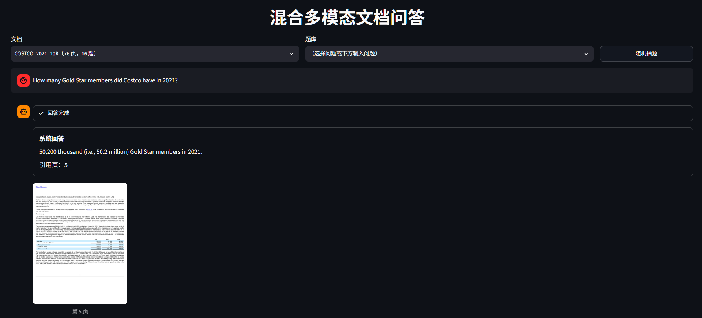
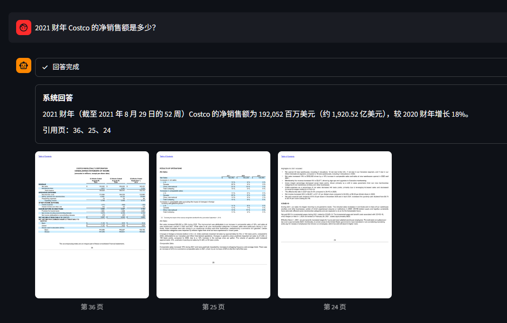
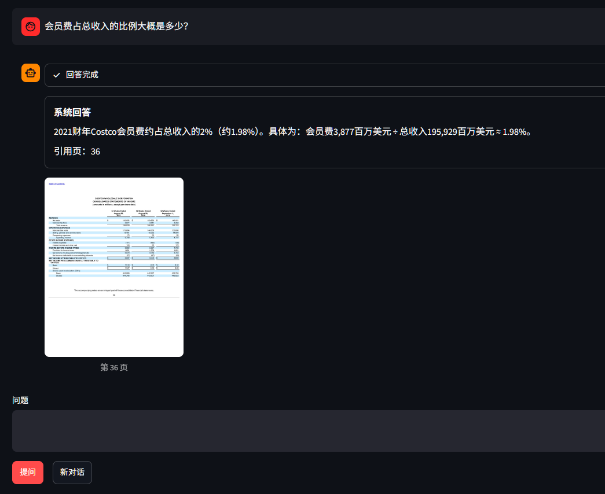

# 混合多模态文档 RAG

> 面向长 PDF 的文档问答：每一页同时作为**文本**和**图像**建立索引，由视觉模型依据页图作答；当前页中没有证据时，交给 **agent** 自行检索与翻页。




在 [MMLongBench-Doc](https://huggingface.co/datasets/yubo2333/MMLongBench-Doc)（135 份 PDF、6522 页、1082 题，平均 48 页 / 份）上，闭域检索 **r@1 0.581**、作答 **Acc 0.650**。所有对比结论都带配对 bootstrap 95% 置信区间。

## 目录

- [混合多模态文档 RAG](#混合多模态文档-rag)
  - [目录](#目录)
  - [功能](#功能)
    - [界面](#界面)
  - [工作原理](#工作原理)
  - [效果](#效果)
    - [检索（闭域，845 道有有效金标页的题）](#检索闭域845-道有有效金标页的题)
    - [作答（全量 1082 题，官方抽答案 + 官方判分）](#作答全量-1082-题官方抽答案--官方判分)
    - [agent](#agent)
    - [成本与延迟（每题）](#成本与延迟每题)
  - [方法选型](#方法选型)
  - [运行](#运行)
  - [项目结构](#项目结构)
  - [数据](#数据)

## 功能

- **三路混合检索**：BM25、文本向量、图像向量分别召回，凸组合融合后再用 cross-encoder 重排。
- **图表转文字建索引**：用成本较低的视觉模型把每页的图、表、照片转写为文字并拼接进正文，图类证据的检索覆盖率提升 11.7 个点。
- **基于页图作答**：视觉模型直接读页面截图，表格和图中的数字无需先转成文本。
- **能自行补充证据的 agent**：前 4 页没有答案时，可更换关键词重新检索、按页号翻页，最后给出答案与引用页。
- **过程可见**：界面实时显示检索到的起点页、模型调用轮次、检索词与查看过的页。
- **多轮追问**：「那第三季度呢？」会结合上文补全为完整问题后再检索。
- **内置评测**：检索指标、官方判分的作答评测、分组统计与配对 bootstrap 置信区间均在仓库中。

### 界面

中文提问也可以，这一题引用了三页：



追问「会员费占总收入的比例大概是多少？」，系统结合上文补全问题后重新检索，并给出比例：



## 工作原理

```
PDF ──渲染──> 页图（长边 2000 px）
              ├─ 有文本层直接取；扫描页 / 乱码页走 PaddleOCR ──> 正文 + 每块 bbox
              └─ 视觉模型逐页描述图表照片 ────────────────────> "Visual content: ..."
                                                │
                      正文 + 视觉描述 ──────────┴──> Milvus（一行一页）
                                                     ├ BM25 稀疏向量（Milvus 内置 Function 自动算）
                                                     ├ 文本 dense 1024 维
                                                     └ 图像 dense 1152 维

问题 ──> 三路各取前 50 ──凸组合 (0.25 / 0.55 / 0.20)──> 前 30 ──重排──> 前 10
                                                                        │
                                                    前 4 页页图 ──> 视觉模型作答
                                                                        │
                                        证据不足时 ──> agent：search_pages / view_pages / answer
```

**解析**：PDF 含文本层时直接提取，并保留每个文本块的 bbox；扫描页与文本层乱码的页走 PaddleOCR。页图长边统一缩放到 2000 px，实测不影响 OCR 识别结果，同时降低 OCR 耗时与图像嵌入成本。

**视觉描述**：文档中大量证据位于图表内，仅凭正文无法检索到。用成本较低的视觉模型逐页将图、表、照片转写为一段文字，拼接进正文后再建索引，全库一次的成本为 ¥4.32。

**检索**：三路各取前 50，分数各自 min-max 归一后按权重相加，即凸组合；取前 30 交给 cross-encoder 重排，最后返回前 10。权重由 2 折交叉验证选定。

**作答**：将重排后的前 4 页页图与问题一并交给视觉模型，要求其仅依据这些页作答；无法作答时输出「Not answerable」，并在最后一行列出引用页。

**agent**：单 agent，自行实现循环，提供三个工具——在本文档内按语义检索、按页号查看页图、作答。最多 5 次模型调用、累计查看 12 页，超出上限或调用超时则强制其依据已看过的页作答。

## 效果

### 检索（闭域，845 道有有效金标页的题）

| 路线 | r@1 | r@10 | MRR | 前 4 页含全部金标 |
|---|---|---|---|---|
| BM25 | 0.433 | 0.809 | 0.670 | 0.604 |
| 文本 dense | 0.419 | 0.804 | 0.659 | 0.569 |
| 图像 dense | 0.258 | 0.695 | 0.477 | 0.408 |
| 三路凸组合 | 0.465 | 0.847 | 0.711 | 0.632 |
| **+ 重排（前 30 候选）** | **0.581** | **0.897** | **0.826** | **0.731** |

视觉描述带来的提升，同为重排路线：r@1 0.526 → 0.581，**+0.055\***；前 4 页含全部金标 +0.057\*；其中 Figure 类证据 0.601 → **0.718，+0.117\***。带 \* 表示配对 bootstrap 95% 置信区间不跨 0。

### 作答（全量 1082 题，官方抽答案 + 官方判分）

一次作答，即把前 4 页页图交给视觉模型：**Acc 0.650 / F1 0.634**。分组 Acc 如下，组间存在重叠，一道题可标注多种证据类型：

| 题目类型 | 题数 | Acc |
|---|---|---|
| 不可回答题 | 223 | **0.771** |
| 单页题 | 494 | 0.719 |
| 表格证据 | 218 | 0.636 |
| 版面类证据 | 119 | 0.624 |
| 图表证据 | 178 | 0.602 |
| 图片证据 | 304 | 0.573 |
| 纯文本证据 | 305 | 0.572 |
| 跨页题 | 372 | **0.487** |

不可回答题最高，为 0.771，说明模型能够明确给出「文档中不含该信息」，而不是强行编造数值；单页题 0.719，证据集中在一页，检索只要把该页排进前 4 即可。跨页题最低，仅 0.487。

按单页 / 跨页对每种证据类型再拆分一次可以看到，**失分主要由跨页与否决定，而非证据类型**：

| 证据类型 | 单页 Acc | 跨页 Acc |
|---|---|---|
| 表格 | 0.782（n=104） | 0.498（n=113） |
| 版面 | 0.744（n=56） | 0.510（n=62） |
| 图表 | 0.726（n=98） | 0.450（n=80） |
| 图片 | 0.662（n=174） | 0.457（n=127） |
| 纯文本 | 0.628（n=160） | 0.499（n=138） |

跨页题需要把分散在多页上的数字汇总后再计算：检索要一次把所有金标页都排进前 4，目前只有 73.1% 的题能做到；作答还要完成加减与比较，两端都容易失分。单页题中图片类与纯文本类低于表格类，前者需要真正读懂图，后者需要在整页文字中定位到具体一小段。

失分按阶段拆解，统计在加入视觉描述之前完成：证据给全仍答错 35%、只检索到部分金标页 31%、一个金标页都没检索到 21%、不可回答题判错 12%、标注本身没有有效金标页 2%。检索与作答各占约一半。

### agent

另取 200 题，在同一套检索下与一次作答配对比较，指标为 Acc：

| 路线 | 全部（200 题） | 跨页题（68） | 起点证据不全（39） | 不可回答题（41） |
|---|---|---|---|---|
| 一次作答 | 0.645 | 0.451 | 0.296 | **0.805** |
| agent | **0.655** | **0.556** | **0.424** | 0.707 |
| 差值 | +0.010（打平） | **+0.105\*** | +0.128（边缘） | −0.098（边缘） |

总分打平，**增益集中在跨页与起点证据不全的题**，与上一节的分组分析一致；代价是不可回答题上更容易强行作答，成本翻倍。200 题中仅 28% 触发检索，平均 1.59 次模型调用，其中 138 题一次作答即结束，额外开销集中在确实需要补充证据的题上。

### 成本与延迟（每题）

同一批 200 题上实测：

| 做法 | 花费 | p50 / p90 |
|---|---|---|
| 一次作答 | ¥0.0111 | 8.1 s / 12.0 s |
| agent | ¥0.0234 | 9.6 s / 27.6 s |
| 追问改写 | 不到 ¥0.001 | 约 1 s |

## 方法选型

每条选择背后都有一组对照实验，完整数字见 [docs/results_summary.md](docs/results_summary.md)。

| 决策 | 依据 |
|---|---|
| 融合用凸组合，不用 RRF | MP-DocVQA 500 题 r@1：凸组合 0.486 > BM25 0.458 > RRF 0.420 |
| 加 cross-encoder 重排 | 比凸组合 r@1 +0.132\*；候选取前 30 与前 50 打平，取 30 以节省成本 |
| 保留图像路 | 加入视觉描述后移除图像路，前 30 候选含全部金标下降 0.009\*；权重重新交叉验证不显著，维持原值 |
| 每页不切块 | 该数据集的证据以整页为单位，切块会打散表格与图注 |
| 作答给 4 页 | k=6 总分 +0.015，不显著，且不可回答题反而变差 |
| 限制思考预算 1024 token | 与默认思考准确率打平，p90 由 68 s 降至 15.6 s |
| 不引入 LangChain / LlamaIndex | 框架的抽象层包裹了检索、提示词与 agent 循环，修改细节和排查问题都隔了一层；整条链路自行实现共 2200 行 |
| 负结果同样记录 | 切块、更换嵌入模型、表格结构化、更大的 OCR 模型均不显著或更差 |


## 运行

需要一个[通义百炼](https://bailian.console.aliyun.com/) API Key，用于嵌入、重排与视觉作答；另需本地 Milvus，扫描页 OCR 还需安装 paddlepaddle。API Key 写入项目根目录的 `.env`：`DASHSCOPE_API_KEY=sk-xxx`。

```bash
pip install -r requirements.txt
docker compose -f milvus/milvus-standalone-docker-compose.yml up -d --wait

# 建索引：每一步的输入是上一步的输出
python build_dataset.py      # PDF --> 页图 + pages / queries / qrels / answers
python parse_corpus.py       # 文本层直接提取，扫描页走 OCR --> corpus.jsonl
python describe_pages.py     # 视觉描述，全库 6522 页约 ¥4.3
python build_index.py        # 两路嵌入 + 写进 Milvus

# 跑 demo
python -m uvicorn demo.app:app --port 8000
python -m streamlit run demo/ui.py

# 跑评测
python evaluate.py --scope closed --route rerank_convex_bm25_text_image
python evaluate_answers.py --scope closed --route answer_rerank_convex_bm25_text_image
```

换数据集只改 `docrag/config.py` 里的 `DATASET` 一行，数据目录、Milvus 表名、评测结果目录都跟着变。

## 项目结构

```
docrag/
  config.py              数据集登记表 + 各阶段常量
  dataset/               下载、渲染页图、解析（文本层 / OCR）、视觉描述
  retrieval/             BM25 / dense / 凸组合 / 重排，一条路线一个文件
  generation/            作答、官方抽答案与判分、追问改写
  agent/                 工具（搜索 / 看页 / 作答）与 agent 循环
  indexing.py            Milvus 表结构、索引、写入
  embeddings.py          嵌入接口封装：批量、并发、限流退避
  evaluation.py          检索指标（r@k、MRR、全金标覆盖）
demo/                    FastAPI 后端 + Streamlit 前端
evaluations/             评测结果

```


## 数据

- 评测数据集 [MMLongBench-Doc](https://huggingface.co/datasets/yubo2333/MMLongBench-Doc)，作答判分沿用官方的抽答案与判分代码（`docrag/generation/mmlongbench_official/`）。
- 方法选型阶段的对照数据集 [MP-DocVQA](https://huggingface.co/datasets/lmms-lab/MP-DocVQA)。
- 嵌入、重排、视觉作答用阿里云[通义百炼](https://bailian.console.aliyun.com/)；向量库 [Milvus](https://milvus.io/)；OCR 用 [PaddleOCR](https://github.com/PaddlePaddle/PaddleOCR)。
