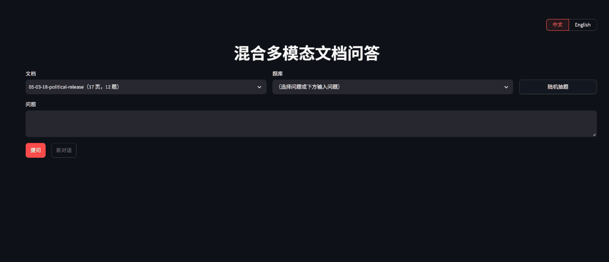
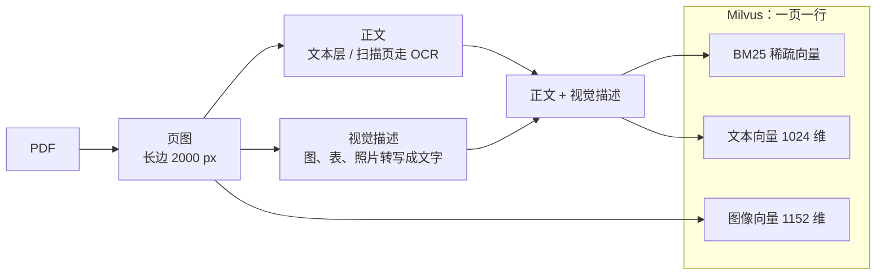
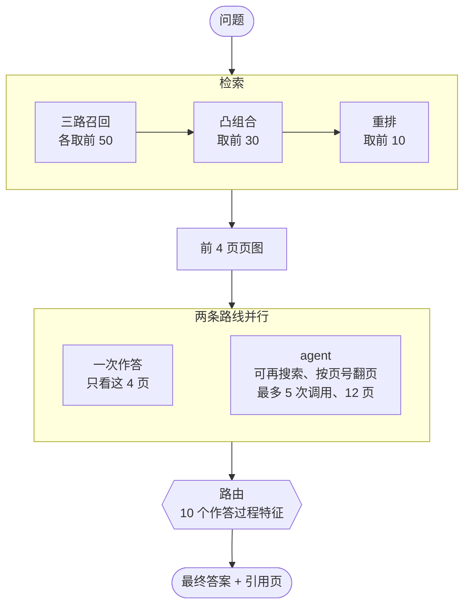

# 混合多模态文档 RAG

**简体中文** | [English](README.en.md)

> 面向长 PDF 的文档问答：每一页同时作为**文本**和**图像**建立索引，由视觉模型依据页图作答；每道题同时走**一次作答**和 **agent** 两条路线，再由一个轻量分类器按作答过程择一。




*演示：在 Costco 2021 年报上连问三轮——读表格 --> 追问时结合上文补全问题 --> 年报里没有直接给出的 EBITDA，由 agent 检索、翻页后算出，路由采信 agent。*

在 [MMLongBench-Doc](https://huggingface.co/datasets/yubo2333/MMLongBench-Doc)（2026-09-14 快照：135 份 PDF、6522 页、1082 题，平均 48 页 / 份）上，闭域检索 **r@1 0.581 / r@10 0.897**，作答 **Acc 0.677**。所有对比结论都带配对 bootstrap 95% 置信区间。

## 目录

- [混合多模态文档 RAG](#混合多模态文档-rag)
  - [目录](#目录)
  - [功能](#功能)
  - [工作原理](#工作原理)
  - [模型](#模型)
  - [效果](#效果)
    - [检索（闭域，845 道有有效金标页的题）](#检索闭域845-道有有效金标页的题)
    - [作答（全量 1082 题）](#作答全量-1082-题)
    - [作答路线与路由](#作答路线与路由)
    - [成本与延迟（每题）](#成本与延迟每题)
  - [方法选型](#方法选型)
  - [运行](#运行)
  - [项目结构](#项目结构)
  - [数据](#数据)

## 功能

- **三路混合检索**：每页先由成本较低的视觉模型把图、表、照片转写成文字拼进正文，再以 BM25、文本向量、图像向量三路分别召回，凸组合融合后用 cross-encoder 重排；其中转写这一步使图类证据的检索覆盖率提升 11.7 个点。
- **基于页图作答**：视觉模型直接读页面截图，表格和图中的数字无需先转成文本。
- **两条作答路线，按题择一**：一次作答直接看前 4 页；agent 可以更换关键词重新检索、按页号翻页。两条并行跑完后，由一个轻量分类器根据作答过程决定采信哪一条——agent 在跨页题上更强，一次作答在「文档中没有」的题上更可靠。
- **过程可见**：界面实时显示检索到的起点页、模型调用轮次、检索词与查看过的页，以及路由最终采信了哪条路线、两条路线各自的回答。
- **多轮追问**：可结合上文补全为完整问题后再检索。
- **中英界面**：右上角切换语言，地址加 `?lang=en` 直接打开英文界面。
- **内置评测**：检索指标、作答评测、分组统计与配对 bootstrap 置信区间均在仓库中。

## 工作原理

**建索引**（离线，每页做成 Milvus 里的一行）



**回答一道题**（在线）



**解析**：PDF 含文本层时按块直接提取并按阅读顺序拼接；文本层过短或乱码的页走 PaddleOCR。页图长边统一缩放到 2000 px，即不影响 OCR 识别结果，同时又降低 OCR 耗时与图像嵌入成本。

**视觉描述**：文档中大量证据位于图表内，仅凭正文无法检索到。用成本较低的视觉模型逐页将图、表、照片转写为一段文字，拼接进正文后再建索引。

**检索**：三路各取前 50，分数各自 min-max 归一后按权重相加，即凸组合；取前 30 交给 cross-encoder 重排，最后返回前 10。权重由 2 折交叉验证选定。

**作答**：将重排后的前 4 页页图与问题一并交给视觉模型，要求其仅依据这些页作答；无法作答时输出「Not answerable」，并在最后一行列出引用页。

**agent**：单 agent，自行实现循环，提供三个工具——在本文档内按语义检索、按页号查看页图、作答。最多 5 次模型调用、累计查看 12 页，超出上限或调用超时则强制其依据已看过的页作答。

**路由**：两条路线各有所长，因此不固定用哪一条。两条并行跑完后，取 10 个作答过程中可观察的信号——agent 检索了几次、调用了几次模型、看了几页、引用了几页、是否兜底、两边答案长度、两边是否拒答、输出 token 数——交给一个逻辑回归，输出「采信 agent 的概率」，超过阈值用 agent 的答案，否则用一次作答的。权重由 `train_router.py` 离线训练后存进 `docrag/agent/router_weights.json`，代码里只有方程；权重文件不存在时退回「agent 检索过才采信它」的规则，无需任何标注即可运行。demo 里两条路线并行：一次作答放在后台线程，agent 答完后最多再等 10 s（`demo/app.py` 的 `ROUTE_WAIT_SECONDS`），等不到或出错就直接采用 agent 的答案；界面显示采信了哪条路线、依据，以及两条路线各自的回答。

## 模型

以下模型均来自阿里云[通义百炼](https://bailian.console.aliyun.com/)。

| 环节 | 模型 | 说明 |
|---|---|---|
| 视觉描述 | qwen3.7-flash | 逐页把图、表、照片转写为文字 |
| 文本嵌入 | qwen3.7-text-embedding | 正文与视觉描述拼接后整页一条向量 |
| 图像嵌入 | tongyi-embedding-vision-plus| 整页页图一条向量 |
| 重排 | qwen3.7-text-rerank | 附一段英文任务说明，对前 30 个候选重排 |
| 作答与 agent | qwen3.8-flash | 视觉模型直接读页图；两条路线的思考预算都限制为 1024 token |
| 追问改写 | qwen3.7-flash | 关闭思考、温度 0、15 秒超时，失败则沿用原问题 |
| 评测抽答案 | qwen3.7-plus | 判分流程中把自由文本答案抽成可比对的形式 |

模型名与思考预算（`THINKING_BUDGET = 1024`，两条路线共用）集中在 `docrag/config.py`，追问改写与评测抽答案的两个常量位于各自模块顶部，更换模型改一行。各环节的选择均有对照实验支撑，见[方法选型](#方法选型)。

## 效果

### 检索（闭域，845 道有有效金标页的题）

| 路线 | r@1 | r@10 | MRR | 前 4 页含全部金标 |
|---|---|---|---|---|
| BM25 | 0.433 | 0.809 | 0.670 | 0.604 |
| 文本 dense | 0.419 | 0.804 | 0.659 | 0.569 |
| 图像 dense | 0.258 | 0.695 | 0.477 | 0.408 |
| 三路凸组合 | 0.465 | 0.847 | 0.711 | 0.632 |
| **+ 重排（前 30 候选）** | **0.581** | **0.897** | **0.826** | **0.731** |

视觉描述带来的提升，同为重排路线：r@1 0.526 → 0.581，**+0.055\***；前 4 页含全部金标 +0.057\*；其中 Figure 类证据 0.601 → **0.718，+0.117\***。带 \* 表示配对 bootstrap 95% 置信区间不跨 0。

### 作答（全量 1082 题）

一次作答是两条作答路线中的一条，即把前 4 页页图直接交给视觉模型：**Acc 0.643 / F1 0.628**。下面的分组用它做基准，另一条路线与路由的结果见[作答路线与路由](#作答路线与路由)。分组 Acc 如下。分组沿用数据集自带判分脚本的口径：单页题按 `evidence_pages` 长度为 1 计，其中含 7 道同样只标了一页的不可回答题，因此三类题数之和略大于总题数；证据类型也允许一题多标。

| 题目类型 | 题数 | Acc |
|---|---|---|
| 不可回答题 | 223 | **0.749** |
| 单页题 | 494 | 0.711 |
| 版面类证据 | 119 | 0.640 |
| 表格证据 | 218 | 0.623 |
| 图片证据 | 304 | 0.594 |
| 纯文本证据 | 305 | 0.581 |
| 图表证据 | 178 | 0.568 |
| 跨页题 | 372 | **0.488** |

不可回答题最高，为 0.749，说明模型能够明确给出「文档中不含该信息」，而不是强行编造数值；单页题 0.711，证据集中在一页，检索只要把该页排进前 4 即可。跨页题最低，仅 0.488。

按单页 / 跨页对每种证据类型再拆分一次可以看到，**失分主要由跨页与否决定，而非证据类型**：

| 证据类型 | 单页 Acc | 跨页 Acc |
|---|---|---|
| 表格 | 0.772（n=104） | 0.483（n=113） |
| 版面 | 0.726（n=56） | 0.572（n=62） |
| 图表 | 0.686（n=98） | 0.423（n=80） |
| 图片 | 0.690（n=174） | 0.467（n=127） |
| 纯文本 | 0.660（n=160） | 0.482（n=138） |

跨页题需要把分散在多页上的数字汇总后再计算：检索要一次把所有金标页都排进前 4，目前只有 73.1% 的题能做到；作答还要完成加减与比较，两端都容易失分。单页题中纯文本、图表、图片类低于表格类：图类需要真正读懂图，纯文本需要在整页文字中定位到具体一小段。

按「检索起点的前 4 页是否已含全部金标」再拆一层，三类题对应三种不同的病因：跨页题的失分主要来自检索装不下多页证据，单页题主要来自证据已给全却答错，不可回答题则来自该拒答时仍然作答。完整的失分分布（按题型、答案格式、证据类型）见 [docs/results_summary.md](docs/results_summary.md#失分分布分类器路由全量-1082-题)。

### 作答路线与路由

每道题跑两条作答路线再择一。全量 1082 题、同一套检索、同样的起点 4 页、同样的思考预算，逐题配对，指标为 Acc：

| 路线 | 全部（1082） | 单页（501） | 跨页（358） | 不可回答（223） | 每题 |
|---|---|---|---|---|---|
| 一次作答 | 0.643 | 0.707 | 0.488 | 0.749 | ¥0.0093 |
| agent | 0.655 | 0.710 | 0.625 | 0.578 | ¥0.0172 |
| 检索过才采信 agent（无需训练） | 0.662\* | 0.715 | 0.572 | 0.691 | ¥0.0265 |
| **分类器路由** | **0.677\*** | 0.709 | 0.618 | 0.700 | ¥0.0265 |

分类器路由比一次作答高 **+0.034\***（区间 [+0.019, +0.050]），比无需训练的手工规则高 +0.015\*：保住了跨页题的大部分增益（0.618 对 agent 的 0.625），同时把不可回答题从 0.578 拉回 0.700。指标为五折交叉验证的 out-of-fold 值，阈值固定为 0.5，没有针对测试折调过。

**为什么需要路由**：两条路线的强弱是结构性的，不是随机波动。

| 分组 | 一次作答 | agent | 差值 |
|---|---|---|---|
| 跨页（358） | 0.488 | **0.625** | **+0.136\*** |
| 起点证据不全（228） | 0.243 | **0.483** | **+0.240\*** |
| 不可回答（223） | **0.749** | 0.578 | **−0.170\*** |
| 全部（1082） | 0.643 | 0.655 | +0.012 |

单独使用 agent 时总分打平，原因是跨页与检索失败的题上的增益，恰好被不可回答题上的损失抵消——它是一个再检索机制，不是普遍增强。路由的作用就是按题取两者之长。

**泛化验证**：agent 的提示词是在其中 200 题上选定的，因此另报未参与选型的 882 题：跨页 **+0.130\***、起点证据不全 **+0.228\***、不可回答 **−0.198\***、总分 −0.003，与全量一致，说明上述结构不是在选型集上过拟合出来的。路由本身在这 882 题上比一次作答高 **+0.029\***。

**路由学到了什么**：查看页数、模型调用次数权重最大且为正——agent 确实投入了工作才采信它；任一方回答「文档中没有」为负——此时退回一次作答。对生成随机性也更稳：同一批题重新采样一次，裸 agent 由 0.720 降至 0.686，而路由 0.702 → 0.702 不变。

**开销**：agent 侧 25% 的题触发检索，平均 1.59 次模型调用，745 题一次作答即结束，兜底强制作答 16 题，工具报错 2 次。路由要求两条路都跑，每题 ¥0.0265，约为一次作答的 2.8 倍，但两条并行，延迟与只跑 agent 基本相同；训练成本则很低——学习曲线上每折 20 条标注即可达到 +0.030（用满全部为 +0.034），而且标注要的是「两个回答哪个更好」的成对判断，不需要标准答案。没有权重文件时退回无需标注的手工规则，仍有 **+0.019\***。

### 成本与延迟（每题）

全量 1082 题上实测，生成侧按 qwen3.8-flash 单价折算：

| 做法 | 花费 | p50 / p90 |
|---|---|---|
| 一次作答 | ¥0.0093 | 8.7 s / 15.0 s |
| agent | ¥0.0172 | 11.1 s / 30.8 s |
| **两条并行 + 路由** | **¥0.0265** | 11.9 s / 31.2 s |
| 重排一次（30 页候选） | ¥0.0096 | — |
| 追问改写 | 不到 ¥0.001 | 约 1 s |

两条路线并行，延迟取较慢的一条：demo 里 agent 答完后最多再等一次作答 10 s，等不到就直接用 agent 的答案，按全量耗时模拟只有 1% 的题等不到；串行则是 20.9 s / 42.7 s。agent 的成本高在输入——每多一轮，此前看过的页图要重新发送一次。

## 方法选型

每条选择背后都有一组对照实验，完整数字见 [docs/results_summary.md](docs/results_summary.md)。

| 决策 | 依据 |
|---|---|
| 融合用凸组合，不用 RRF | MP-DocVQA 500 题 r@1：凸组合 0.486 > BM25 0.458 > RRF 0.420 |
| 加 cross-encoder 重排 | 比凸组合 r@1 +0.132\*；候选取前 30 与前 50 打平，取 30 以节省成本 |
| 保留图像路 | 加入视觉描述后移除图像路，前 30 候选含全部金标下降 0.009\*；权重重新交叉验证不显著，维持原值 |
| 每页不切块 | 该数据集的证据以整页为单位，切块会打散表格与图注 |
| 作答给 4 页 | k=6 总分 +0.015，不显著，且不可回答题反而变差 |
| 两条路线都限制思考预算 1024 token | 200 题上与默认思考打平，p90 由 68 s 降至 15.6 s；两条路线同一设置才可比 |
| 不引入 LangChain / LlamaIndex | 框架的抽象层包裹了检索、提示词与 agent 循环，修改细节和排查问题都隔了一层；整条链路自行实现共 2200 行 |
| 两条作答路线按题择一 | 单独使用 agent 总分打平（+0.012）；按作答过程特征路由后 +0.034\*，跨页增益保住 0.618、不可回答回到 0.700 |
| 负结果同样记录 | 切块、更换嵌入模型、表格结构化、更大的 OCR 模型结果均不显著或更差 |

## 运行

需要一个[通义百炼](https://bailian.console.aliyun.com/) API Key，用于嵌入、重排与视觉作答；另需本地 Milvus，扫描页 OCR 还需安装 paddlepaddle。API Key 写入项目根目录的 `.env`：`DASHSCOPE_API_KEY=sk-xxx`。

```bash
pip install -r requirements.txt
docker compose -f milvus/milvus-standalone-docker-compose.yml up -d --wait

# 建索引：每一步的输入是上一步的输出
python build_dataset.py      # PDF --> 页图 + pages / queries / qrels / answers
python parse_corpus.py       # 文本层直接提取，扫描页走 OCR --> corpus.jsonl
python describe_pages.py     # 视觉描述，全库 6522 页约 ¥4.3
python build_index.py        # 两路嵌入 + 写进 Milvus

# 跑 demo
python -m uvicorn demo.app:app --port 8000
python -m streamlit run demo/ui.py

# 跑评测
python evaluate.py --scope closed --route rerank_convex_bm25_text_image
python evaluate_answers.py --scope closed --route answer_rerank_convex_bm25_text_image
python evaluate_answers.py --scope closed --route agent_rerank_convex_bm25_text_image
python evaluate_answers.py --scope closed --route route_rerank_convex_bm25_text_image

# 重训答案路由（读上面两条作答路线的 run 文件，覆盖 docrag/agent/router_weights.json）
python train_router.py --scope closed
```

换数据集只改 `docrag/config.py` 里的 `DATASET` 一行，数据目录、Milvus 表名、评测结果目录都跟着变。

## 项目结构

```
docrag/
  config.py              数据集登记表 + 各阶段常量
  dataset/               下载、渲染页图、解析（文本层 / OCR）、视觉描述
  retrieval/             BM25 / dense / 凸组合 / 重排，一条路线一个文件
  generation/            作答、抽答案与判分、追问改写
  agent/                 工具（搜索 / 看页 / 作答）、agent 循环、答案路由与其权重文件
  indexing.py            Milvus 表结构、索引、写入
  embeddings.py          嵌入接口封装：批量、并发、限流退避
  evaluation.py          检索指标（r@k、MRR、全金标覆盖）
demo/                    FastAPI 后端 + Streamlit 前端
evaluations/             评测结果
```

## 数据

- 评测数据集 [MMLongBench-Doc](https://huggingface.co/datasets/yubo2333/MMLongBench-Doc)，作答判分沿用该数据集自带的抽答案与判分代码（`docrag/generation/mmlongbench_official/`）。
  - **本仓库使用的快照**：2026-09-14 下载，`data/train-00000-of-00001.parquet` 提交 `2ff6aa92`，共 **1082 题 / 135 份 PDF / 6522 页**；其中不可回答题 223 道，有有效金标页、可用于检索评测的 845 道。
  - 该数据集的题数随仓库更新而变动（撰写本文时 Hugging Face 数据浏览器显示 1.09k 行，与本地快照的 1082 题不同）。**本文全部分数均在上述快照上、用该数据集自带的字符串判分代码得出，不能直接与其他快照或其他判分方式下的公开分数比较。**
- 方法选型阶段的对照数据集 [MP-DocVQA](https://huggingface.co/datasets/lmms-lab/MP-DocVQA)。
- 嵌入、重排、视觉作答用阿里云[通义百炼](https://bailian.console.aliyun.com/)；向量库 [Milvus](https://milvus.io/)；OCR 用 [PaddleOCR](https://github.com/PaddlePaddle/PaddleOCR)。
